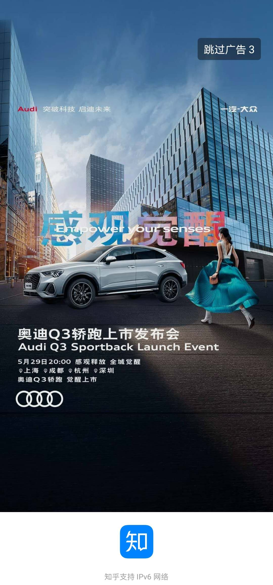
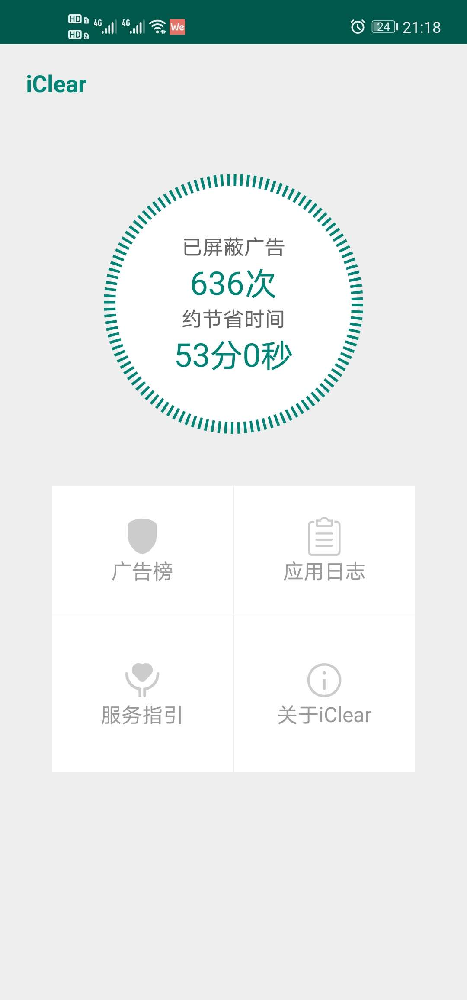
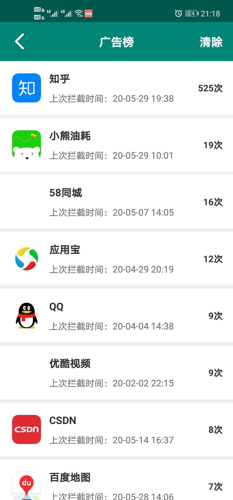
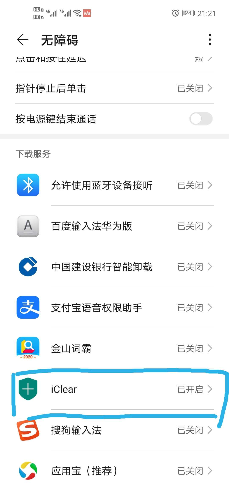

# iClear
android app首屏广告拦截器

### 初衷

众多app的启动页基本发展成了一个硬广告，用户几乎必须接受。

虽然广告页会有个跳过按钮，但是手动点击非常困难。非常讨厌。

尤其是知乎app，简直就是广告轰炸机。

如这种：

这样，于是iClear的想法出来了。

通过外挂把这个广告屏蔽掉。

通过android提供的AccessbilityService可以辅助点击广告页面的跳过按钮。

达到屏蔽的效果。

经过长时间的使用和修改，效果还可以。感觉基本消除了大部分广告。

### iClear介绍

1. 检索页面，有跳过按钮，辅助点击一下

2. 将点击过的app存入数据库

3. 计算大约节约时间

4. 使用了iconfont、数据库、读取app icon

首页：

广告列表页：

### 如何使用

在系统设置中找到无障碍设置，将iClear打开即可。

或者直接从iClear首页>服务指引直达无障碍页面，将其打开。

### 下载

[iClear下载](./app/release/app-release.apk)

